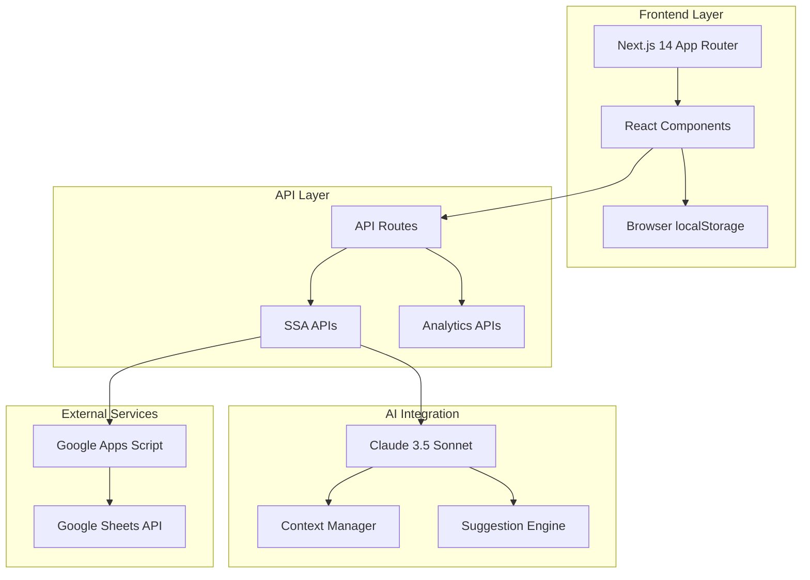
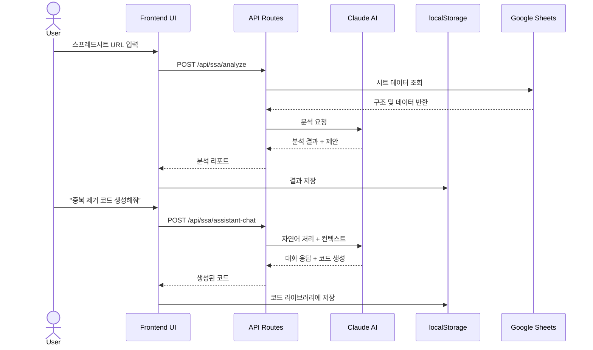
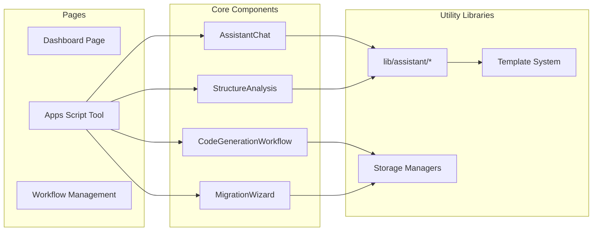

# 🤖 Automation Master Web

> AI 기반 Google Sheets Apps Script 자동화 플랫폼


**Automation Master Web**은 복잡한 Google Sheets 스프레드시트를 분석하고, AI를 활용하여 최적화된 Apps Script 코드를 자동으로 생성하는 포괄적인 개발 플랫폼입니다.

---

## 📑 목차

- [프로젝트 소개](#-프로젝트-소개)
- [주요 기능](#-주요-기능)
- [Screenshots](#-screenshots)
- [시스템 아키텍처](#-시스템-아키텍처)
- [기술 스택](#-기술-스택)
- [시작하기](#-시작하기)
- [사용자 가이드](#-사용자-가이드)
- [프로젝트 구조](#-프로젝트-구조)
- [API 문서](#-api-문서)
- [핵심 컴포넌트](#-핵심-컴포넌트)
- [데이터 저장 구조](#-데이터-저장-구조)
- [배포 가이드](#-배포-가이드)
- [개발 가이드](#-개발-가이드)
- [테스트](#-테스트)
- [문제 해결](#-문제-해결)
- [참고 자료](#-참고-자료)

---

## 🎯 프로젝트 소개

### 핵심 가치 제안

Automation Master Web은 다음과 같은 문제를 해결합니다:

1. **복잡한 스프레드시트 수식의 성능 문제** → AI 기반 Apps Script로 변환하여 실행 속도 향상
2. **수작업 데이터 정리의 비효율성** → 자동화된 데이터 클리닝 및 마이그레이션
3. **Apps Script 코드 작성의 높은 진입 장벽** → 자연어 대화로 코드 자동 생성
4. **반복적인 데이터 처리 작업** → 재사용 가능한 코드 템플릿 및 라이브러리

### 대상 사용자

- **Google Sheets 파워 유저**: 복잡한 스프레드시트를 Apps Script로 전환하려는 사용자
- **노코드/로우코드 사용자**: 깊은 프로그래밍 지식 없이 자동화가 필요한 사용자
- **데이터 분석가**: 수동 데이터 프로세스를 자동화된 스크립트로 마이그레이션
- **개발자**: 빠른 Apps Script 프로토타이핑 및 코드 생성

---

## ✨ 주요 기능

### 1. 🧠 AI 기반 Apps Script 코드 생성

- **스프레드시트 구조 분석**: 시트 구조, 수식, 데이터 패턴 자동 분석
- **자연어 코드 생성**: 한국어/영어로 원하는 기능을 설명하면 코드 자동 생성
- **최적화된 코드**: 성능과 가독성을 고려한 Apps Script 코드 생성
- **프로젝트 타입 지원**:
  - Sheets-bound projects (특정 스프레드시트에 연결)
  - Standalone projects (독립적이고 재사용 가능)

### 2. 💬 Claude 3.5 Sonnet 대화형 어시스턴트

- **실시간 대화형 AI**: Claude 3.5 Sonnet과의 자연스러운 대화
- **컨텍스트 인식 제안**: 스프레드시트 데이터를 분석하여 지능형 권장사항 제공
- **멀티턴 대화**: 세션 간 컨텍스트 유지
- **대화 내역 관리**: 저장, 불러오기, 내보내기 기능

### 3. 📊 스프레드시트 구조 분석

- **AI 기반 분석**: 데이터 구조, 관계, 패턴 자동 감지
- **데이터 클리닝 로드맵**: 단계별 데이터 정리 권장사항
- **문제 감지**: 중복 데이터, 빈 행/열, 수식 오류 자동 식별
- **시각화**: Mermaid 다이어그램으로 시트 간 관계 표현

### 4. 🔄 점진적 마이그레이션 마법사

- **단계별 가이드**: 수식에서 Apps Script로의 안전한 마이그레이션
- **시트 복사 및 백업**: 원본 데이터 보호
- **검증 및 테스트**: 마이그레이션 전후 데이터 일치성 확인
- **진행 상황 추적**: 실시간 마이그레이션 진행률 표시

### 5. 📚 코드 라이브러리 & 버전 관리

- **코드 저장소**: 생성된 코드를 라이브러리에 저장하고 재사용
- **버전 관리**: 여러 코드 버전 관리 및 비교
- **템플릿 시스템**: 자주 사용하는 패턴을 템플릿으로 저장
- **실행 히스토리**: 코드 실행 결과 추적 및 재실행

### 6. 🎯 10단계 개발 워크플로우

체계적인 프로젝트 관리를 위한 단계별 워크플로우:

1. 아이디어 발견 (Idea Discovery)
2. PDR (Product Design Requirements)
3. 시스템 사양 (System Specification)
4. UI/UX 디자인 + Playwright 벤치마킹
5. 기술 스택 선택 (Tech Stack Selection)
6. 프론트엔드 개발 (Frontend Development)
7. 백엔드 개발 (Backend Development)
8. 테스팅 (Testing)
9. 배포 준비 (Deployment Preparation)
10. 배포 및 운영 (Deployment & Operations)

---

## 📸 Screenshots

### 메인 대시보드
```
[스크린샷 플레이스홀더]
- 프로젝트 개요
- 최근 분석 결과
- 빠른 작업 실행
```

### AI 어시스턴트 채팅 인터페이스
```
[스크린샷 플레이스홀더]
- 자연어 대화
- 실시간 코드 생성
- 제안 카드
```

### 코드 생성 워크플로우
```
[스크린샷 플레이스홀더]
- 템플릿 선택
- 코드 생성
- 버전 관리
- 실행 히스토리
```

### 구조 분석 결과
```
[스크린샷 플레이스홀더]
- 시트 관계 다이어그램
- 데이터 품질 분석
- 개선 제안
```

---

## 🏗️ 시스템 아키텍처

### 전체 시스템 구조



### 데이터 플로우



### 컴포넌트 아키텍처



---

## 🔧 기술 스택

### Frontend Framework
- **Next.js 14** - App Router, Server Components, API Routes
- **React 18.3** - UI 라이브러리
- **TypeScript 5.3** - 정적 타입 검사

### UI Components & Styling
- **Radix UI** - 접근성이 보장된 UI 프리미티브
  - Accordion, Dialog, Progress, Select, Tabs, AlertDialog 등
- **Tailwind CSS 3.4** - 유틸리티 기반 CSS 프레임워크
- **Lucide React** - 아이콘 라이브러리
- **class-variance-authority** - 조건부 스타일링
- **tailwind-merge** - Tailwind 클래스 병합

### AI Integration
- **@anthropic-ai/sdk 0.68.0** - Claude API 공식 SDK
- **Custom Context Manager** - 대화 컨텍스트 관리
- **Suggestion Engine** - 지능형 제안 시스템

### Development & Testing
- **Playwright** - E2E 테스트 및 브라우저 자동화
- **@axe-core/playwright** - 접근성 테스트
- **web-vitals** - 성능 모니터링

### Utilities
- **react-mermaid2** - 다이어그램 렌더링
- **JSZip** - 파일 압축 및 다운로드

### Build & Optimization
- **SWC** - 빠른 컴파일 및 minification
- **Code Splitting** - vendors, Anthropic SDK, Radix UI 별도 청크
- **Image Optimization** - AVIF/WebP 자동 변환

---

## 🚀 시작하기

### 사전 요구사항

시스템에 다음 소프트웨어가 설치되어 있어야 합니다:

- **Node.js** 18.0 이상
- **npm** 또는 **yarn**
- **Anthropic API 키** ([발급 받기](https://console.anthropic.com/))

### 설치 및 실행

#### 1. 저장소 클론

```bash
git clone <repository-url>
cd automationmaster/web
```

#### 2. 의존성 설치

```bash
npm install
# 또는
yarn install
```

#### 3. 환경 변수 설정

`.env.local` 파일을 생성하고 다음 환경 변수를 설정하세요:

```bash
# Anthropic Claude API
ANTHROPIC_API_KEY=your_anthropic_api_key_here

# Google Sheets API (선택사항 - 향후 사용)
# GOOGLE_SHEETS_API_KEY=your_google_api_key

# Next.js 공개 변수
NEXT_PUBLIC_APP_NAME="Automation Master"
NEXT_PUBLIC_APP_VERSION="1.0.0"
```

> 💡 **중요**: API 키 설정 방법에 대한 자세한 내용은 [docs/CLAUDE_API_SETUP.md](./docs/CLAUDE_API_SETUP.md)를 참조하세요.

#### 4. 개발 서버 실행

```bash
npm run dev
```

브라우저에서 [http://localhost:3000](http://localhost:3000)을 열어 애플리케이션에 접속하세요.

#### 5. 프로덕션 빌드

```bash
# 프로덕션 빌드 생성
npm run build

# 프로덕션 서버 실행
npm start
```

---

## 📚 사용자 가이드

Automation Master Web을 효과적으로 사용하기 위한 상세 가이드를 제공합니다:

### 📖 초보자 가이드

**[GETTING_STARTED.md](./docs/GETTING_STARTED.md)** - 처음 사용하시는 분들을 위한 빠른 시작 가이드

- ✅ 5-10분 안에 시작할 수 있는 단계별 튜토리얼
- ✅ 핵심 기능 3가지 (구조 분석, AI 코드 생성, 코드 라이브러리)
- ✅ 실전 예제로 배우는 실용적인 사용법
- ✅ 자주 하는 실수와 해결 방법
- ✅ 빠른 참고 카드 및 키보드 단축키

**대상**: Google Sheets 기본 사용자, Apps Script 입문자

### 🎓 고급 사용자 가이드

**[ADVANCED_GUIDE.md](./docs/ADVANCED_GUIDE.md)** - 고급 기능 및 최적화 완벽 가이드

- ⚡ 전문가 수준의 기능 활용법 (5개 분석 탭, 데이터 클리닝 로드맵)
- ⚡ AI 어시스턴트 마스터하기 (10가지 프롬프트 패턴)
- ⚡ 코드 생성 워크플로우 완벽 이해 (템플릿 → 생성 → 관리)
- ⚡ 버전 관리 및 실행 히스토리 시스템
- ⚡ 마이그레이션 위저드 4단계 프로세스
- ⚡ 5가지 실전 고급 시나리오
- ⚡ 성능 최적화 및 통합 가이드
- ⚡ 완전한 문제 해결 가이드
- ⚡ localStorage 스키마 및 API 참조

**대상**: Apps Script 숙련자, 팀 협업 환경, 대규모 자동화 프로젝트

---

## 📁 프로젝트 구조

```
web/
├── app/                           # Next.js 14 App Router
│   ├── api/                       # API Routes
│   │   ├── ssa/                   # Spreadsheet to Apps Script APIs
│   │   │   ├── analyze/           # 스프레드시트 분석
│   │   │   │   └── route.ts
│   │   │   ├── assistant-chat/    # AI 대화 엔드포인트
│   │   │   │   └── route.ts
│   │   │   ├── code-library/      # 코드 라이브러리 관리
│   │   │   │   └── route.ts
│   │   │   ├── execute-code/      # 코드 실행
│   │   │   │   └── route.ts
│   │   │   ├── generate-code/     # 코드 생성
│   │   │   │   └── route.ts
│   │   │   ├── migrate/           # 마이그레이션 APIs
│   │   │   │   ├── copy-sheet/
│   │   │   │   └── create-sheet/
│   │   │   └── roadmap/           # 데이터 클리닝 로드맵
│   │   │       └── route.ts
│   │   ├── analytics/             # 분석 APIs
│   │   ├── generators/            # 코드 생성기
│   │   ├── health/                # 헬스체크
│   │   ├── performance/           # 성능 모니터링
│   │   └── settings/              # 앱 설정
│   ├── dashboard/                 # 프로젝트 대시보드
│   │   └── page.tsx
│   ├── tools/
│   │   └── appscript/             # Apps Script 도구 (메인 기능)
│   │       ├── components/        # React 컴포넌트
│   │       │   ├── AssistantChat.tsx              # AI 대화 인터페이스
│   │       │   ├── CodeGeneratorChat.tsx          # 자연어 코드 생성
│   │       │   ├── CodeLibraryBrowser.tsx         # 코드 라이브러리 브라우저
│   │       │   ├── CodeGenerationWorkflow.tsx     # 통합 워크플로우
│   │       │   ├── CodeMenuManager.tsx            # 코드 메뉴 관리
│   │       │   ├── CodeVersionList.tsx            # 버전 목록
│   │       │   ├── ConversationHistory.tsx        # 대화 기록
│   │       │   ├── DataCleaningRoadmap.tsx        # 데이터 클리닝 로드맵
│   │       │   ├── EnhancedCodeGenerator.tsx      # 고급 코드 생성기
│   │       │   ├── ExecutionHistoryViewer.tsx     # 실행 히스토리
│   │       │   ├── MigrationWizard.tsx            # 마이그레이션 마법사
│   │       │   ├── NextActionBanner.tsx           # 다음 액션 배너
│   │       │   ├── StructureAnalysis.tsx          # 구조 분석 UI
│   │       │   ├── TemplateManager.tsx            # 템플릿 관리
│   │       │   ├── WorkflowProgress.tsx           # 워크플로우 진행
│   │       │   └── [기타 20+ 컴포넌트]
│   │       └── page.tsx                           # 메인 Apps Script 페이지
│   ├── workflow/                  # 워크플로우 관리
│   │   └── page.tsx
│   ├── layout.tsx                 # 루트 레이아웃
│   ├── page.tsx                   # 홈페이지
│   └── globals.css                # 전역 스타일
│
├── lib/                           # 유틸리티 라이브러리
│   ├── assistant/                 # AI 어시스턴트 로직
│   │   ├── context.ts             # 컨텍스트 관리
│   │   ├── storage.ts             # 세션 스토리지
│   │   ├── code-library-storage.ts # 코드 라이브러리 저장
│   │   └── suggestion-engine.ts   # 제안 엔진
│   ├── code-menu-storage.ts       # 코드 메뉴 관리
│   ├── conversation-storage.ts    # 대화 기록 저장
│   ├── execution-history-storage.ts # 실행 히스토리
│   ├── template-storage.ts        # 템플릿 저장
│   └── [모니터링, 캐싱, 성능 유틸리티]
│
├── types/                         # TypeScript 타입 정의
│   ├── assistant.ts               # AI 어시스턴트 타입
│   ├── code-menu.ts               # 코드 메뉴 타입
│   ├── conversation.ts            # 대화 타입
│   ├── execution-history.ts       # 실행 히스토리 타입
│   └── roadmap.ts                 # 로드맵 타입
│
├── components/                    # 공유 UI 컴포넌트
│   └── ui/                        # Radix UI 컴포넌트
│
├── docs/                          # 문서
│   └── CLAUDE_API_SETUP.md        # Claude API 설정 가이드
│
├── tests/                         # Playwright 테스트
│   └── example.spec.ts
│
├── scripts/                       # 유틸리티 스크립트
│   └── archive/                   # 아카이브된 스크립트
│
├── public/                        # 정적 파일
│   ├── images/
│   └── icons/
│
├── .env.local                     # 환경 변수 (gitignored)
├── next.config.mjs                # Next.js 설정
├── tailwind.config.ts             # Tailwind CSS 설정
├── tsconfig.json                  # TypeScript 설정
├── package.json                   # 의존성 및 스크립트
├── playwright.config.ts           # Playwright 설정
└── README.md                      # 이 파일
```

---

## 📡 API 문서

### 주요 API 엔드포인트

#### 1. 스프레드시트 분석

**`POST /api/ssa/analyze`**

스프레드시트 구조를 분석하고 AI 기반 인사이트를 제공합니다.

**요청 본문:**
```typescript
{
  spreadsheetId: string;
  spreadsheetTitle?: string;
  samplingMode?: 'full' | 'sample';
  maxRows?: number;
}
```

**응답:**
```typescript
{
  success: boolean;
  analysis?: {
    sheets: SheetAnalysis[];
    summary: {
      totalSheets: number;
      totalFormulas: number;
      complexity: 'low' | 'medium' | 'high';
    };
    issues: Issue[];
    recommendations: Recommendation[];
  };
  error?: string;
}
```

#### 2. AI 어시스턴트 대화

**`POST /api/ssa/assistant-chat`**

Claude AI와의 대화형 인터페이스로 코드 생성 및 질문 응답을 제공합니다.

**요청 본문:**
```typescript
{
  sessionId: string;
  userMessage: string;
  analysisResult?: any;
  conversationHistory?: ChatMessage[];
  additionalContext?: {
    recentCode?: GeneratedCode;
    currentSheet?: string;
  };
}
```

**응답:**
```typescript
{
  success: boolean;
  message?: ChatMessage;
  suggestions?: AISuggestion[];
  action?: {
    type: 'generate_code' | 'modify_code' | 'show_preview' | 'none';
    data?: any;
  };
  error?: string;
}
```

#### 3. 코드 생성

**`POST /api/ssa/generate-code`**

자연어 요청을 Apps Script 코드로 변환합니다.

**요청 본문:**
```typescript
{
  userRequest: string;
  analysisResult?: any;
  relatedStepId?: string;
}
```

**응답:**
```typescript
{
  success: boolean;
  code?: GeneratedCode;
  explanation?: string;
  error?: string;
}
```

**GeneratedCode 인터페이스:**
```typescript
interface GeneratedCode {
  id: string;
  title: string;
  description: string;
  code: string;
  type: 'data_cleaning' | 'automation' | 'validation' | 'transformation';
  targetSheets: string[];
  createdAt: string;
  metadata?: {
    estimatedImpact?: {
      timeSaved?: string;
      rowsAffected?: number;
    };
  };
}
```

#### 4. 코드 실행

**`POST /api/ssa/execute-code`**

생성된 코드를 시뮬레이션 또는 실제로 실행합니다.

**요청 본문:**
```typescript
{
  code: string;
  codeId?: string;
  spreadsheetId: string;
  targetSheets?: string[];
  simulationMode?: boolean;
}
```

**응답:**
```typescript
{
  success: boolean;
  result?: CodeExecutionResult;
  error?: string;
}
```

#### 5. 코드 라이브러리 관리

**`POST /api/ssa/code-library`**

코드 라이브러리의 CRUD 작업을 처리합니다.

**요청 본문:**
```typescript
{
  action: 'list' | 'get' | 'save' | 'update' | 'delete';
  id?: string;
  code?: CodeLibraryItem;
  updates?: Partial<CodeLibraryItem>;
}
```

**응답:**
```typescript
{
  success: boolean;
  items?: CodeLibraryItem[];
  item?: CodeLibraryItem;
  total?: number;
  error?: string;
}
```

#### 6. 마이그레이션 APIs

**`POST /api/ssa/migrate/copy-sheet`**

시트를 복사하여 백업을 생성합니다.

**요청 본문:**
```typescript
{
  spreadsheetId: string;
  sourceSheetId: number;
  newSheetName: string;
}
```

**`POST /api/ssa/migrate/create-sheet`**

새 시트를 생성합니다.

**요청 본문:**
```typescript
{
  spreadsheetId: string;
  sheetName: string;
  rowCount?: number;
  columnCount?: number;
}
```

#### 7. 데이터 클리닝 로드맵

**`POST /api/ssa/roadmap`**

데이터 클리닝을 위한 단계별 로드맵을 생성합니다.

**요청 본문:**
```typescript
{
  analysisResult: any;
  priorities?: string[];
}
```

**응답:**
```typescript
{
  success: boolean;
  roadmap?: DataCleaningRoadmap;
  error?: string;
}
```

---

## 🧩 핵심 컴포넌트

### 1. AssistantChat.tsx (11KB)

AI 대화형 인터페이스를 제공하는 핵심 컴포넌트입니다.

**주요 기능:**
- Claude 3.5 Sonnet과의 실시간 대화
- 컨텍스트 인식 제안 표시
- 대화 내역 관리 (내보내기, 초기화)
- 액션 실행 (코드 생성, 수정)

**사용 예시:**
```typescript
<AssistantChat
  spreadsheetId="your-sheet-id"
  spreadsheetTitle="My Spreadsheet"
  analysisResult={analysisData}
  onGenerateCode={(params) => handleCodeGeneration(params)}
  onModifyCode={(params) => handleCodeModification(params)}
/>
```

**주요 Props:**
- `spreadsheetId`: 스프레드시트 ID
- `spreadsheetTitle`: 스프레드시트 제목
- `analysisResult`: 분석 결과 데이터
- `onGenerateCode`: 코드 생성 콜백
- `onModifyCode`: 코드 수정 콜백

### 2. CodeGenerationWorkflow.tsx (19KB)

템플릿, 코드 생성, 실행 히스토리를 통합한 완전한 워크플로우 컴포넌트입니다.

**주요 기능:**
- 3단계 워크플로우 (템플릿 → 코드 생성 → 실행 히스토리)
- 템플릿에서 코드 생성기로 데이터 주입
- 실행 히스토리 저장 및 재실행
- 코드 라이브러리 통합

**사용 예시:**
```typescript
<CodeGenerationWorkflow
  analysisResult={analysisData}
  spreadsheetId="your-sheet-id"
/>
```

### 3. StructureAnalysis.tsx (23KB)

AI 기반 스프레드시트 구조 분석 및 시각화 컴포넌트입니다.

**주요 기능:**
- 5개 탭: 개요, 다이어그램, 시트 분석, 패턴 분석, 개선 제안
- Mermaid 다이어그램으로 시트 간 관계 시각화
- 수식 복잡도 분석
- AI 어시스턴트 및 코드 라이브러리 통합

**사용 예시:**
```typescript
<StructureAnalysis
  analysis={analysisResult}
  spreadsheetId="your-sheet-id"
  spreadsheetTitle="My Spreadsheet"
  analysisResult={fullAnalysisData}
  onGenerateCode={handleCodeGen}
  onModifyCode={handleCodeMod}
  onSelectCode={handleCodeSelect}
/>
```

### 4. MigrationWizard.tsx (29KB)

수식을 Apps Script로 점진적으로 마이그레이션하는 단계별 마법사입니다.

**주요 기능:**
- 4단계 마이그레이션 프로세스
- 시트 백업 자동 생성
- 실시간 진행 상황 표시
- 오류 처리 및 롤백 지원

**사용 예시:**
```typescript
<MigrationWizard
  spreadsheetId="your-sheet-id"
  analysisResult={analysisData}
  onMigrationComplete={handleComplete}
/>
```

### 5. EnhancedCodeGenerator.tsx (17KB)

자연어 입력을 통한 고급 코드 생성기입니다.

**주요 기능:**
- 메뉴명 + 기능 설명 + 상세 설명 입력
- 임시/영구 저장 옵션
- 외부 데이터 주입 기능 (템플릿에서)
- 라이브러리 전환 기능

**사용 예시:**
```typescript
<EnhancedCodeGenerator
  analysisResult={analysisData}
  externalData={{
    menuName: "데이터 정리",
    functionDescription: "중복 제거",
    detailedDescription: "A열 기준으로 중복된 행 제거"
  }}
/>
```

### 6. CodeLibraryBrowser.tsx (10KB)

저장된 코드 스니펫을 검색하고 재사용하는 브라우저 컴포넌트입니다.

**주요 기능:**
- 제목, 설명, 태그로 검색
- 카테고리별 필터링
- 즐겨찾기 관리
- 코드 복사, 다운로드, 삭제

**사용 예시:**
```typescript
<CodeLibraryBrowser
  onSelectCode={(item) => {
    // 선택된 코드 처리
    console.log(item.code);
  }}
/>
```

---

## 💾 데이터 저장 구조

모든 데이터는 **브라우저 localStorage**에 저장되며, 다음과 같은 스키마를 사용합니다:

### 1. 분석 히스토리

**키**: `analysis_history`

**스키마**:
```typescript
interface AnalysisHistoryItem {
  spreadsheetId: string;
  spreadsheetTitle: string;
  analyzedAt: string;
  summary: {
    totalSheets: number;
    totalFormulas: number;
    complexity: 'low' | 'medium' | 'high';
  };
}
```

**저장 예시**:
```json
[
  {
    "spreadsheetId": "abc123",
    "spreadsheetTitle": "Sales Data 2024",
    "analyzedAt": "2024-01-15T10:30:00Z",
    "summary": {
      "totalSheets": 5,
      "totalFormulas": 120,
      "complexity": "medium"
    }
  }
]
```

### 2. 대화 세션

**키**: `assistant_session_[sessionId]`

**스키마**:
```typescript
interface ChatSession {
  sessionId: string;
  spreadsheetId: string;
  spreadsheetTitle: string;
  createdAt: string;
  updatedAt: string;
  messages: ChatMessage[];
  context: any;
  summary?: string;
}

interface ChatMessage {
  id: string;
  role: 'user' | 'assistant';
  content: string;
  timestamp: string;
  metadata?: any;
}
```

### 3. 코드 라이브러리

**키**: `code_library_item_[itemId]`

**스키마**:
```typescript
interface CodeLibraryItem {
  id: string;
  code: GeneratedCode;
  category: string;
  tags: string[];
  favorite: boolean;
  usageCount: number;
  lastUsedAt?: string;
}
```

### 4. 코드 메뉴

**키**: `code_menu_[menuId]`

**스키마**:
```typescript
interface CodeMenuItem {
  menuId: string;
  menuName: string;
  category: string;
  description: string;
  versions: CodeVersion[];
  createdAt: string;
  updatedAt: string;
  favorite: boolean;
}

interface CodeVersion {
  versionId: string;
  versionNumber: number;
  code: string;
  status: 'draft' | 'final';
  isActive: boolean;
  createdAt: string;
  note?: string;
}
```

### 5. 템플릿

**키**: `template_[templateId]`

**스키마**:
```typescript
interface Template {
  id: string;
  menuName: string;
  functionDescription: string;
  detailedDescription: string;
  category: string;
  tags: string[];
  createdAt: string;
  usageCount: number;
}
```

### 6. 실행 히스토리

**키**: `execution_history_[historyId]`

**스키마**:
```typescript
interface ExecutionHistory {
  id: string;
  code: string;
  codeTitle: string;
  executedAt: string;
  result: 'success' | 'failure';
  output?: string;
  error?: string;
  executionTime?: number;
  spreadsheetId: string;
}
```

### 데이터 마이그레이션 전략

브라우저 localStorage는 용량 제한(보통 5-10MB)이 있으므로, 다음 전략을 사용합니다:

1. **자동 정리**: 최근 5개의 분석 결과만 유지
2. **압축**: 큰 데이터는 JSON.stringify 후 압축
3. **선택적 저장**: 사용자가 명시적으로 저장한 항목만 영구 보관
4. **내보내기/가져오기**: JSON 파일로 백업 및 복원 지원

---

## 🚢 배포 가이드

### Vercel 배포 (권장)

Vercel은 Next.js 애플리케이션 배포에 최적화되어 있습니다.

#### 1. Vercel CLI 설치 및 배포

```bash
# Vercel CLI 설치
npm i -g vercel

# 로그인
vercel login

# 배포 (첫 배포 시 프로젝트 설정)
vercel

# 프로덕션 배포
vercel --prod
```

#### 2. Vercel 대시보드에서 환경 변수 설정

프로젝트 설정 → Environment Variables에서 다음 변수를 추가:

```
ANTHROPIC_API_KEY=sk-ant-...
NEXT_PUBLIC_APP_NAME=Automation Master
NEXT_PUBLIC_APP_VERSION=1.0.0
```

#### 3. Git 통합 (자동 배포)

Vercel과 GitHub 저장소를 연결하면 `develop` 브랜치에 푸시할 때마다 자동으로 배포됩니다.

### 환경 변수 관리

**필수 환경 변수**:
- `ANTHROPIC_API_KEY`: Claude API 키

**선택 환경 변수**:
- `NEXT_PUBLIC_APP_NAME`: 앱 이름 (기본값: "Automation Master")
- `NEXT_PUBLIC_APP_VERSION`: 앱 버전
- `GOOGLE_SHEETS_API_KEY`: Google Sheets API 키 (향후 사용)

### 성능 최적화

#### 1. 이미지 최적화

Next.js의 자동 이미지 최적화를 활용:

```typescript
// next.config.mjs
images: {
  formats: ['image/avif', 'image/webp'],
  deviceSizes: [640, 750, 828, 1080, 1200, 1920, 2048, 3840],
}
```

#### 2. 코드 스플리팅

주요 라이브러리를 별도 청크로 분리:

```typescript
// next.config.mjs
webpack: (config) => {
  config.optimization.splitChunks = {
    cacheGroups: {
      anthropic: {
        test: /@anthropic-ai/,
        name: 'anthropic',
        chunks: 'all',
      },
      radix: {
        test: /@radix-ui/,
        name: 'radix',
        chunks: 'all',
      },
    },
  };
  return config;
}
```

#### 3. SWC Minification

```typescript
// next.config.mjs
swcMinify: true
```

### 빌드 검증

배포 전 로컬에서 프로덕션 빌드를 테스트:

```bash
# 프로덕션 빌드
npm run build

# 빌드 결과 확인
npm start

# 또는 정적 분석
npm run lint
```

---

## 👨‍💻 개발 가이드

### 코딩 컨벤션

#### TypeScript

- **엄격한 타입 체크**: `strict: true` 사용
- **명시적 타입 정의**: 함수 반환 타입 명시
- **인터페이스 우선**: type보다 interface 선호

```typescript
// ✅ Good
interface User {
  id: string;
  name: string;
}

function getUser(id: string): Promise<User> {
  // ...
}

// ❌ Avoid
type User = {
  id: string;
  name: string;
}

function getUser(id: string) {
  // 반환 타입 누락
}
```

#### React 컴포넌트

- **함수형 컴포넌트**: 클래스 컴포넌트 사용 금지
- **명시적 Props 타입**: 인터페이스로 Props 정의
- **React Hooks**: 적절한 의존성 배열 사용

```typescript
// ✅ Good
interface ButtonProps {
  label: string;
  onClick: () => void;
  disabled?: boolean;
}

export function Button({ label, onClick, disabled = false }: ButtonProps) {
  return (
    <button onClick={onClick} disabled={disabled}>
      {label}
    </button>
  );
}
```

#### 파일 구조

- **컴포넌트**: PascalCase (예: `AssistantChat.tsx`)
- **유틸리티**: camelCase (예: `formatDate.ts`)
- **타입**: PascalCase (예: `assistant.ts` 내부의 `ChatSession`)

### Git 브랜치 전략

```
main (프로덕션)
  └── develop (개발)
        ├── feature/ai-assistant
        ├── feature/code-library
        └── bugfix/migration-error
```

**브랜치 명명 규칙**:
- `feature/[기능명]`: 새 기능 개발
- `bugfix/[버그명]`: 버그 수정
- `hotfix/[긴급수정]`: 프로덕션 긴급 수정
- `refactor/[리팩토링명]`: 코드 리팩토링

### 커밋 메시지 규칙

```
<타입>: <제목>

<본문>

🤖 Generated with Claude Code
Co-Authored-By: Claude <noreply@anthropic.com>
```

**타입**:
- `feat`: 새 기능
- `fix`: 버그 수정
- `refactor`: 코드 리팩토링
- `docs`: 문서 변경
- `style`: 코드 포맷팅
- `test`: 테스트 추가/수정
- `chore`: 빌드 작업, 패키지 관리

**예시**:
```
feat: AI 어시스턴트 대화 히스토리 저장 기능 추가

- localStorage 기반 대화 세션 관리
- 세션별 컨텍스트 유지
- 내보내기/가져오기 기능

🤖 Generated with Claude Code
Co-Authored-By: Claude <noreply@anthropic.com>
```

### Pull Request 프로세스

1. **브랜치 생성**: `develop`에서 feature 브랜치 생성
2. **개발 및 커밋**: 작은 단위로 자주 커밋
3. **테스트**: Playwright 테스트 실행 및 통과
4. **PR 생성**: 의미 있는 제목과 설명 작성
5. **코드 리뷰**: 팀원 리뷰 및 피드백 반영
6. **병합**: `develop`로 병합

---

## 🧪 테스트

### Playwright E2E 테스트

#### 테스트 실행

```bash
# Chromium에서 테스트
npm run test:chromium

# 모든 브라우저에서 테스트
npx playwright test

# UI 모드로 테스트
npx playwright test --ui

# 특정 파일만 테스트
npx playwright test tests/example.spec.ts
```

#### 테스트 작성 예시

```typescript
// tests/assistant-chat.spec.ts
import { test, expect } from '@playwright/test';

test.describe('Assistant Chat', () => {
  test('should display chat interface', async ({ page }) => {
    await page.goto('/tools/appscript');

    // AI 어시스턴트 섹션 확인
    const chatSection = page.locator('[data-testid="assistant-chat"]');
    await expect(chatSection).toBeVisible();
  });

  test('should send message and receive response', async ({ page }) => {
    await page.goto('/tools/appscript');

    // 메시지 입력
    const input = page.locator('textarea[placeholder*="질문"]');
    await input.fill('중복된 행을 제거해줘');

    // 전송 버튼 클릭
    await page.click('button:has-text("전송")');

    // AI 응답 대기
    await page.waitForSelector('.assistant-message', { timeout: 10000 });

    // 응답 확인
    const response = page.locator('.assistant-message').first();
    await expect(response).toContainText('코드');
  });
});
```

#### 접근성 테스트

```typescript
// tests/accessibility.spec.ts
import { test, expect } from '@playwright/test';
import { injectAxe, checkA11y } from 'axe-playwright';

test.describe('Accessibility', () => {
  test('should have no accessibility violations', async ({ page }) => {
    await page.goto('/tools/appscript');
    await injectAxe(page);

    // WCAG 2.1 Level AA 준수 확인
    await checkA11y(page, null, {
      detailedReport: true,
      detailedReportOptions: {
        html: true,
      },
    });
  });
});
```

### 테스트 커버리지

목표 커버리지:
- **API Routes**: 80% 이상
- **핵심 컴포넌트**: 70% 이상
- **유틸리티 함수**: 90% 이상

---

## 🔧 문제 해결

### Claude API 연결 문제

**증상**: "API key is not configured" 에러

**해결 방법**:
1. `.env.local` 파일에 `ANTHROPIC_API_KEY`가 설정되어 있는지 확인
2. 개발 서버 재시작: `npm run dev`
3. API 키 유효성 확인: [Anthropic Console](https://console.anthropic.com/)

자세한 내용은 [docs/CLAUDE_API_SETUP.md](./docs/CLAUDE_API_SETUP.md)를 참조하세요.

### localStorage 용량 초과

**증상**: "QuotaExceededError" 발생

**해결 방법**:
1. 브라우저 개발자 도구 → Application → Local Storage에서 불필요한 데이터 삭제
2. 분석 히스토리 자동 정리 (최근 5개만 유지)
3. 대용량 데이터는 내보내기 후 삭제

```typescript
// 수동으로 오래된 데이터 정리
const cleanOldData = () => {
  const keys = Object.keys(localStorage);
  keys.forEach(key => {
    if (key.startsWith('analysis_') || key.startsWith('execution_')) {
      const item = JSON.parse(localStorage.getItem(key)!);
      const age = Date.now() - new Date(item.createdAt).getTime();
      const thirtyDays = 30 * 24 * 60 * 60 * 1000;
      if (age > thirtyDays) {
        localStorage.removeItem(key);
      }
    }
  });
};
```

### 브라우저 호환성

**지원 브라우저**:
- Chrome/Edge 90+
- Firefox 88+
- Safari 14+

**알려진 문제**:
- Safari < 14: localStorage 제한 더 엄격
- Firefox < 88: Mermaid 다이어그램 렌더링 이슈

### 성능 최적화 팁

**느린 페이지 로드**:
1. Next.js 이미지 최적화 사용
2. 불필요한 컴포넌트 lazy loading
3. API 응답 캐싱 활용

```typescript
// 컴포넌트 lazy loading
import dynamic from 'next/dynamic';

const HeavyComponent = dynamic(() => import('./HeavyComponent'), {
  loading: () => <p>Loading...</p>,
  ssr: false,
});
```

**API 응답 느림**:
1. Claude API 타임아웃 설정 확인
2. 분석 데이터 샘플링 모드 사용
3. 불필요한 대화 히스토리 전송 최소화

---

## 📚 참고 자료

### 내부 문서

- [Claude API 설정 가이드](./docs/CLAUDE_API_SETUP.md)
- [Phase 3-4 구현 가이드](./PHASE_3-4_IMPLEMENTATION_GUIDE.md)

### 외부 링크

- [Next.js 공식 문서](https://nextjs.org/docs)
- [Anthropic Claude API 문서](https://docs.anthropic.com/)
- [Radix UI 문서](https://www.radix-ui.com/)
- [Tailwind CSS 문서](https://tailwindcss.com/docs)
- [Playwright 문서](https://playwright.dev/)

### 관련 기술

- [Google Apps Script 가이드](https://developers.google.com/apps-script)
- [Google Sheets API 문서](https://developers.google.com/sheets/api)

---

## 📄 라이선스 및 기여

이 프로젝트는 **비공개(Private)** 프로젝트입니다.

### 내부 팀 사용 가이드

- 프로젝트 코드 및 문서는 팀 내부 전용입니다.
- 외부 공유 또는 배포 시 사전 승인이 필요합니다.
- 민감한 API 키 및 환경 변수는 절대 커밋하지 마세요.

### 기여 프로세스

1. 이슈 생성 또는 기능 제안
2. `develop` 브랜치에서 feature 브랜치 생성
3. 변경 사항 개발 및 테스트
4. Pull Request 생성 및 코드 리뷰 요청
5. 리뷰 승인 후 `develop`로 병합

---

## 🙏 감사의 말

이 프로젝트는 다음 오픈소스 라이브러리와 서비스를 활용하여 개발되었습니다:

- **Next.js** - Vercel
- **React** - Meta
- **Anthropic Claude** - Anthropic AI
- **Radix UI** - WorkOS
- **Tailwind CSS** - Tailwind Labs
- **Playwright** - Microsoft

---

<div align="center">

**Automation Master Web** - AI 기반 Google Sheets Apps Script 자동화 플랫폼

Made with ❤️ by Internal Team

</div>
